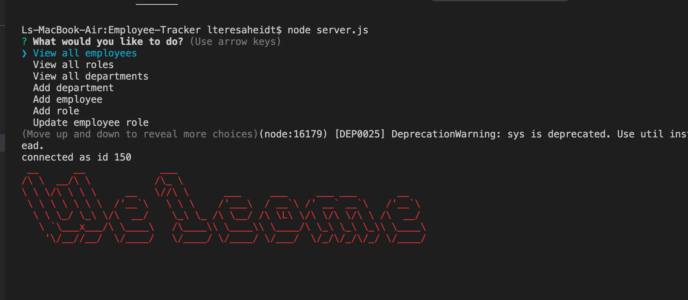
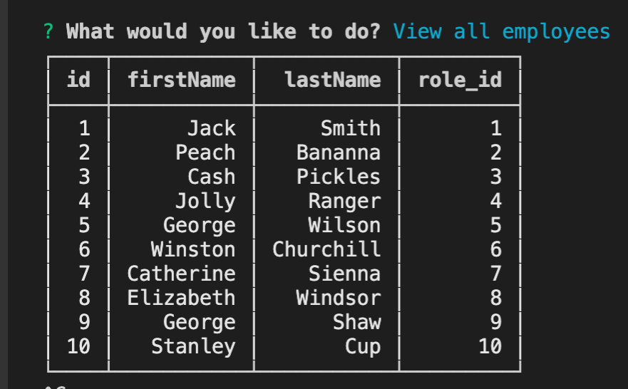

# Employee Tracker 👾🤖👾

## Table of contents:
* About
* How
* Why
* Techologues used
* Imgs
* Issues
* Links

## About:
This is an employee tracker to help the user view and interact with information stored in the database.

## How:
Using MySQL for the database, the user can find an employee, department, salary and manager and view this data in the command line.The user can also ADD the following; employee, departments and role. Then the user can DELETE the following; employee, department and role.

## Why:
Super effective way to manage emplpoyees, departments and salaries. 

## Technologies used:
Node modules, Inquirer packages & MySQL

## Imgs:
Welcome to the employee-tracker! This was designed using asciimo.

This is how the user will view the employees. With keyboard arrows when the user views employees, a list of all employees will appear from the database.

## Issues:
There were some bugs in the code. Commented out in the server.js file are the code snippets that did not run. For FUTURE to be solved!
1. View budget
2. Update employee manager
3. View all employees by manager
4. Update employee role

## Links:
[Link to Github](https://teresaheidt.github.io/Employee-Tracker/)

[Link to video]( )

